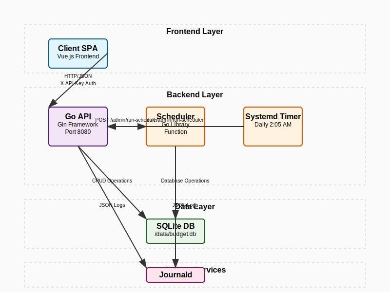

# budget-api

## Documentation

- [Backend Specification](docs/spec.md) - Complete API, database, and architecture documentation



## Authentication

Every request must include header `X-API-Key: <value of $BUDGET_API_KEY>`.
The server panics on startup if `BUDGET_API_KEY` is unset.

**Note:** The `/health` endpoint does not require authentication.

## Docker Deployment

The application can be deployed using Docker Compose for easy containerized deployment.

### Prerequisites

- Docker and Docker Compose installed
- Git (to clone the repository)

### Quick Start

1. **Clone and setup environment:**

   ```bash
   git clone <repository-url>
   cd budget-api
   cd docker
   cp env.example .env
   # Edit .env and set your BUDGET_API_KEY
   ```

2. **Deploy using the deployment script:**

   ```bash
   ./deploy.sh
   ```

   Or manually:

   ```bash
   docker-compose up -d --build
   ```

3. **Verify deployment:**
   ```bash
   docker-compose ps
   curl http://localhost:8080/api/v1/health
   ```

### Environment Configuration

Copy `docker/env.example` to `docker/.env` and configure:

```bash
# Required: Set a secure API key
BUDGET_API_KEY=your-secret-api-key-here-change-this-in-production

# Optional: Customize timezone for scheduler
TZ=Europe/London

# Optional: Change port (default: 8080)
PORT=8080
```

### Docker Compose Services

- **budget-api**: Main API service running on port 8080
- **budget_data**: Persistent volume for SQLite database

### Data Persistence

The SQLite database is stored in a Docker volume (`budget_data`) at `/data/budget.db` inside the container. This ensures data persists across container restarts and updates.

### Health Checks

The service includes health checks that verify the API is responding. Check status with:

```bash
docker-compose ps
```

### Logs and Monitoring

```bash
# View logs
docker-compose logs -f budget-api

# Check service status
docker-compose ps

# Access container shell
docker-compose exec budget-api sh
```

### Updating the Application

```bash
# Pull latest changes and rebuild
git pull
cd docker
docker-compose up -d --build

# Or use the deployment script
./deploy.sh
```

### Stopping the Application

```bash
# Stop services
docker-compose down

# Stop and remove volumes (⚠️ WARNING: This will delete all data)
docker-compose down -v
```

### Production Considerations

1. **Security**: Always change the default `BUDGET_API_KEY` in production
2. **Backups**: The SQLite database is in the `budget_data` volume - backup this volume
3. **Monitoring**: Consider adding external monitoring for the health endpoint
4. **SSL/TLS**: Use a reverse proxy (nginx, traefik) for HTTPS in production

## Dependencies

# Development Tools

| Tool Name     | Version |
| ------------- | ------- |
| sqlc          | v1.29.0 |
| goose         | v3.24.3 |
| golangci-lint | 2.1.6   |

# Systemd Scheduler Timer

The budget app includes a systemd timer that runs the scheduler independently of the API process. This ensures recurring transactions are materialized even if the in-process ticker crashes or the API restarts.

## Installation

```bash
# Install and enable the timer (requires sudo)
sudo make install-timer
```

This will:

- Copy the service and timer files to `/etc/systemd/system/`
- Enable and start the timer
- Show you how to check status and logs

## Adjusting the Cadence

The timer runs **daily at 2:05 AM** by default. To change this, edit `/etc/systemd/system/budget-scheduler.timer`:

### Common Patterns

| Pattern                         | Description       | Example                     |
| ------------------------------- | ----------------- | --------------------------- |
| `OnCalendar=hourly`             | Every hour        | Hourly execution            |
| `OnCalendar=daily`              | Daily at midnight | `OnCalendar=*-*-* 00:00:00` |
| `OnCalendar=weekly`             | Weekly on Sunday  | `OnCalendar=weekly`         |
| `OnCalendar=monthly`            | Monthly on 1st    | `OnCalendar=monthly`        |
| `OnCalendar=*-*-* 02:05:00`     | Daily at 2:05 AM  | Current setting             |
| `OnCalendar=*-*-* 09:00:00`     | Daily at 9 AM     | Custom time                 |
| `OnCalendar=Mon *-*-* 08:00:00` | Mondays at 8 AM   | Specific day/time           |

### After Changing

```bash
sudo systemctl daemon-reload
sudo systemctl restart budget-scheduler.timer
```

## Monitoring

```bash
# Check timer status
systemctl status budget-scheduler.timer

# View recent scheduler runs
journalctl -u budget-scheduler.service

# Follow live scheduler logs
journalctl -u budget-scheduler.service -f

# See when next run is scheduled
systemctl list-timers budget-scheduler.timer
```

## Troubleshooting

- **Timer not running?** Check if the API is accessible: `curl http://localhost:8080/health`
- **Permission denied?** Ensure `BUDGET_API_KEY` is set in the environment
- **Service failing?** Check logs: `journalctl -u budget-scheduler.service -n 50`

# Raspberry Pi – Journald Log‑Size Limits for Budget App

> **Why set limits?**\
> Continuous JSON access logs can fill an SD‑card in weeks.\
> `systemd‑journald` supports disk quotas—configure them once and forget.

---

## Recommended Settings

| Key (`journald.conf`) | Suggested value | Reason                                                                             |
| --------------------- | --------------- | ---------------------------------------------------------------------------------- |
| `SystemMaxUse=`       | **200M**        | Caps total persistent journal size on disk. Old logs rotate away.                  |
| `SystemMaxFileSize=`  | **20M**         | Upper bound per individual file. Creates more, smaller chunks—safer on power loss. |
| `RuntimeMaxUse=`      | default         | Applies only to `/run` (tmpfs) logs; default is fine.                              |
| `MaxRetentionSec=`    | _(optional)_    | Use if you prefer time‑based retention (e.g., `2592000` for 30 days).              |

> **200 MB ≈ 7‑10 days** of single‑user traffic at 30 KB/request.\
> Tune up or down depending on card size and log verbosity.

---

## Step‑by‑Step

1. **Create an override file**

   ```bash
   sudo mkdir -p /etc/systemd/journald.conf.d
   sudo nano /etc/systemd/journald.conf.d/budget-size.conf
   ```

   Paste:

   ```ini
   [Journal]
   SystemMaxUse=200M
   SystemMaxFileSize=20M
   ```

2. **Reload journald**

   ```bash
   sudo systemctl restart systemd-journald
   ```

3. **Verify**

   ```bash
   journalctl --disk-usage
   # → e.g. "Archived and active journals 80.0M, max 200.0M, 120.0M free."
   ```

---

## Ongoing Checks

| Command                               | What it tells you                   |
| ------------------------------------- | ----------------------------------- |
| `journalctl --disk-usage`             | Current on‑disk footprint vs. limit |
| `journalctl -u budgetd -f`            | Tail live API logs                  |
| `ls -lh /var/log/journal/*/*.journal` | See individual rotated files        |

---

## Adjusting Later

- **Need more history?** Increase `SystemMaxUse=` (e.g., `500M`) and restart journald.
- **Card almost full?** Lower the value; journald deletes oldest chunks to comply.
- **Switch to time‑based retention?** Add `MaxRetentionSec=` and remove `SystemMaxUse=`.

---

### TL;DR (one‑liner)

```bash
sudo tee /etc/systemd/journald.conf.d/budget-size.conf <<'EOF'
[Journal]
SystemMaxUse=200M
SystemMaxFileSize=20M
EOF
sudo systemctl restart systemd-journald
journalctl --disk-usage
```
